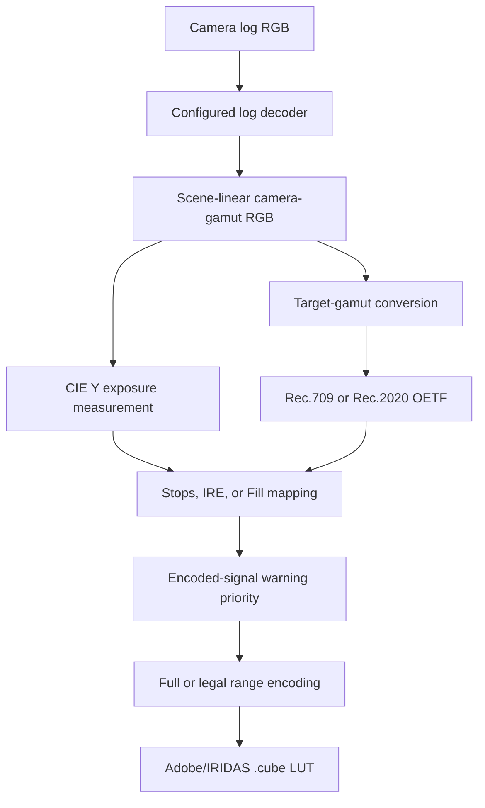

# LUT Builder

> **Work in progress:** LUT Builder works today and is evolving through real camera and monitor testing. Try it, inspect the generated LUTs, and report profiles or workflows that need better coverage.

[](https://www.python.org/)
[](https://docs.astral.sh/uv/)
[](https://www.colour-science.org/)
[](https://github.com/Today20092/lut_builder)
[](LICENSE)

LUT Builder is an open-source CLI for creating diagnostic false-color scene-exposure LUTs for professional camera log formats.

It decodes the selected log curve, measures scene exposure, converts into the target gamut, and writes a portable `.cube` LUT for on-set monitoring or post-production tools.

Use the result in DaVinci Resolve, Final Cut Pro, Premiere Pro, a field monitor, or a supported camera LUT View Assist workflow.

## Why LUT Builder?

- Build custom false-color bands around the exposure values that matter to you.
- Work in stops, IRE, or full-coverage Fill mode.
- Choose colors by hex value or from the bundled Tailwind palette.
- Generate Rec.709 or Rec.2020 diagnostic output.
- Warn when any encoded RGB channel crosses a profile threshold.
- Save a setup as JSON and regenerate it without answering prompts.
- Keep every generated LUT local and offline.

These are diagnostic transforms, not finished Rec.709 or Rec.2020 viewing transforms. They do not include an output rendering transform, tone mapping, or highlight roll-off.

## Requirements

- Windows or macOS
- [Git](https://git-scm.com/)
- [uv](https://docs.astral.sh/uv/getting-started/installation/)

The project requires Python 3.12 or newer. `uv` installs and manages the compatible Python runtime and project dependencies.

## Quick Start

```bash
git clone https://github.com/Today20092/lut_builder.git
cd lut_builder
uv sync
uv run lut-builder build
```

The interactive builder walks through the camera profile, diagnostic output, LUT size, exposure mode, colors, signal warnings, output range, and filename.

Bare filenames are written to `output/luts/`. Enter an explicit path or use `--output-dir` when the LUT should go somewhere else.

### Double-click launchers

| Platform | Launcher | First use |
| --- | --- | --- |
| Windows workspace | `workspace.bat` | Double-click it after installing uv. |
| Windows | `build.bat` | Double-click it after installing uv. |
| macOS | `build.command` | Run `chmod +x build.command` once, then double-click it. |

`workspace.bat` opens the browser workspace; the build launchers start the interactive CLI.

## Commands

| Command | Purpose |
| --- | --- |
| `uv run lut-builder workspace` | Open the local browser workspace. |
| `uv run lut-builder build` | Build a LUT interactively. |
| `uv run lut-builder build --config setup.json` | Regenerate a saved setup without prompts. |
| `uv run lut-builder build --config setup.json --output-dir ~/luts` | Regenerate into a chosen directory. |
| `uv run lut-builder list` | List camera profiles, output encodings, and profile sources. |
| `uv run lut-builder colors` | Browse the bundled Tailwind color palette. |
| `uv run lut-builder colors blue` | Filter the palette by family name. |

Run `uv run lut-builder --help` or add `--help` after a command for the current options.

## Interactive Workflow

You can enter `b` at supported prompts to return to the previous step.

1. Select a camera log profile.
2. Select Rec.709 or Rec.2020 diagnostic output.
3. Choose a 17, 33, or 65 point cube.
4. Choose Stops, IRE, or Fill mode.
5. Define exposure values, colors, and band widths.
6. Enable optional low and high encoded-signal warnings.
7. Choose a monochrome or color base where applicable.
8. Choose full or legal output range.
9. Name the `.cube` file.
10. Optionally save the setup as JSON.

Cube size 65 gives sharp transitions the most lattice resolution. Sizes 17 and 33 are faster and smaller, but host interpolation can soften narrow false-color boundaries.

## Exposure Modes

### Stops

Stops are calculated from scene-linear CIE Y relative to 18% middle grey:

```text
stops = log2(Y / 0.18)
```

CIE Y uses the selected camera gamut's RGB-to-XYZ matrix instead of applying fixed Rec.709 luma weights to wide-gamut camera RGB.

### IRE

IRE bands use target-encoded luma on a 0–100 scale.

| Output range | 0 IRE | 100 IRE |
| --- | ---: | ---: |
| Full/data | Code 0 | Code 1023 |
| Legal/video | Code 64 | Code 940 |

Match the camera, monitor, and host range settings to the LUT. A legal-range LUT can be scaled twice if the host also performs a legal/full conversion.

### Fill

Fill mode assigns every input to the nearest configured stop color. It creates full-coverage false color with no unpainted base image.

### Encoded-signal warnings

Low and high warnings inspect each encoded input channel independently. One channel crossing its profile threshold is enough to trigger the warning color.

These warnings identify encoded-signal boundaries. They do not prove physical sensor clipping, which can vary by camera model, recording mode, exposure index, and processing pipeline.

## Example Setup

```text
Mode:          Stops
Stops:         -2, -1, 0, +1, +2
-2 stops:      blue-800    #1e40af
-1 stop:       sky-400     #38bdf8
 0 stops:      green-500   #22c55e
+1 stop:       yellow-400  #facc15
+2 stops:      orange-500  #f97316
Low warning:   violet-600  #7c3aed
High warning:  red-600     #dc2626
Band width:    Standard, ±0.3 stops
Base:          Monochrome
Range:         Full/data
```

Bands are applied from low to high exposure, so higher-position bands win where ranges overlap. Bands at the same position retain creation order. Encoded-signal warnings are applied after exposure bands and therefore have final priority.

## Supported Camera Profiles

| Profile | Camera gamut | Common camera families |
| --- | --- | --- |
| Sony S-Log3 | S-Gamut3.Cine | FX3, FX6, FX9, a7S III, VENICE |
| Panasonic V-Log | V-Gamut | Lumix S series, GH6, BGH1, VariCam |
| Canon Log 3 | Cinema Gamut | C70, C300 Mark III, C500 Mark II |
| ARRI LogC3 | ARRI Wide Gamut 3 | ALEXA, AMIRA, ALEXA LF |
| RED Log3G10 | REDWideGamutRGB | V-RAPTOR, KOMODO, MONSTRO |

Run `uv run lut-builder list` for the catalog currently installed with your checkout and the source URLs associated with each profile.

Profile names describe signal encodings, not guarantees for every camera mode. Verify the selected gamut, log curve, range, and monitoring path against your camera settings.

## Diagnostic Outputs

| Output | Primaries | Transfer function |
| --- | --- | --- |
| Rec.709 | ITU-R BT.709 | ITU-R BT.709 OETF |
| Rec.2020 | ITU-R BT.2020 | ITU-R BT.2020 OETF |

Configured overlay colors have sRGB meaning. LUT Builder converts them into the selected target gamut before writing them, while preserving the intended Rec.709 values.

## Output Files

| Input | Result |
| --- | --- |
| `my_lut` | `output/luts/my_lut.cube` |
| `my_lut.cube` | `output/luts/my_lut.cube` |
| `custom/my_lut.cube` | `custom/my_lut.cube` |
| `--output-dir D:\LUTs` | `D:\LUTs\<filename>.cube` |

The CLI creates required parent directories. Generated `.cube` files and saved JSON configs are ignored by Git.

### Saved configurations

New setups are saved as version 2 JSON. Existing version 1 configs remain supported and normalize into the same validated setup used by interactive sessions.

```json
{
  "version": 2,
  "profile": "Panasonic V-Log",
  "target": "Rec.709",
  "cube_size": 33,
  "bands": [
    {"stop": 0.0, "color": "#22c55e", "width": 0.3}
  ],
  "band_mode": "stops",
  "fill_mode": false,
  "low_signal_warning": true,
  "low_signal_hex": "#7c3aed",
  "high_signal_warning": true,
  "high_signal_hex": "#dc2626",
  "monochrome": true,
  "legal_range": false,
  "output": "panasonic_false_color.cube"
}
```

Regenerate it with:

```bash
uv run lut-builder build --config setup.json
```

## Loading the LUT

### DaVinci Resolve

Open the Color page, open the LUT folder from the LUTs panel, copy the `.cube` file into it, and refresh the LUT list.

### Panasonic Lumix

Copy the LUT to the camera's supported custom-LUT location, then assign it through LUT View Assist. Confirm the camera's supported cube size and file naming rules first.

### Premiere Pro and Final Cut Pro

Import the `.cube` file as a custom LUT in the application's color workflow. Use it as a monitoring diagnostic, not as the final creative grade.

## How It Works



The profile catalog validates camera and target facts explicitly. Interactive prompts and JSON files are adapters into the same `LutSetup`, and preview and generation share one exposure-mapping implementation.

Colour transitions inside a finite 3D LUT depend on cube resolution and the host's interpolation. Tests exercise neutral ramps at sizes 17, 33, and 65, including band edges and the current half-grid warning tolerance.

For the standards audit and source references, see [False-color LUT correctness](docs/research/false-color-lut-correctness.md).

## Project Layout

```text
lut_builder/
├── src/lut_builder/
│   ├── cli.py       # Commands, prompts, preview, config I/O
│   ├── colors.py    # Tailwind OKLCH palette
│   ├── data.py      # Validated camera and target catalog
│   ├── engine.py    # Decode, transform, overlay, and LUT output
│   ├── presets.py   # Suggested colors and band widths
│   └── setup.py     # Shared setup validation and exposure mapping
├── tests/           # Numerical, semantic, CLI, and regression checks
├── docs/            # Research and agent guidance
├── frontend/        # Shadcn workspace source
├── build.bat        # Windows launcher
├── build.command    # macOS launcher
├── workspace.bat    # Windows browser workspace launcher
└── pyproject.toml   # Package metadata and dependencies
```

## Development

```bash
uv sync
uv run pytest -q
uv run lut-builder --help
uv run lut-builder list
```

Rebuild the bundled browser workspace after frontend changes with `cd frontend`, `npm ci`, and `npm run build`.

The current suite covers config compatibility, catalog validation, log decoding, exposure mapping, signal-range semantics, target-gamut overlays, interpolation boundaries, and CLI output paths.

## Contributing

Read [Contributing.md](Contributing.md) before adding a profile or changing LUT behavior. Camera and transfer-function facts should have primary-source documentation and numerical coverage.

Coding agents should start with [AGENTS.md](AGENTS.md). Repository-specific issue, triage, domain, and research guidance lives under [`docs/`](docs/).

Bug reports and profile requests belong in [GitHub Issues](https://github.com/Today20092/lut_builder/issues).

## License

MIT. See [LICENSE](LICENSE).
